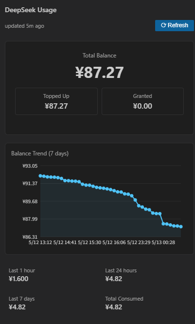
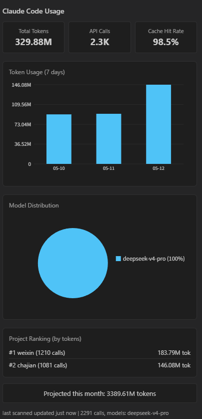
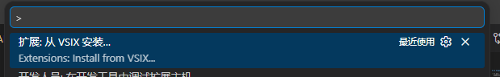
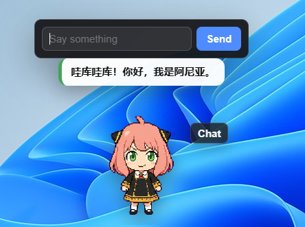

# AI Usage Monitor

在 VS Code 侧栏里查看 DeepSeek 余额和 Claude Code token 使用情况，并提供一个可拖动的桌面宠物提醒你关注 token 消耗。

## 功能

- DeepSeek 余额、消耗趋势和低余额提醒
- Claude Code 今日、本周、本月、累计 token 面板
- 项目、模型、缓存命中等使用分析
- 一键导出月度 Markdown 报告
- 桌面宠物：可切换素材、可聊天、可拖动、可根据用量触发提醒





## 安装最新版

### 从 VSIX 安装

1. 到 GitHub Releases 下载最新的 `.vsix` 文件。
2. 在 VS Code 里按 `Ctrl+Shift+P`。
3. 执行 `Extensions: Install from VSIX...`。
4. 选择下载好的 VSIX 文件并重启 VS Code。



也可以用命令安装：

```bash
code --install-extension deepseek-balance-monitor-0.3.2.vsix
```

### 依赖说明

普通用户不需要安装 Node、npm、Codex 或 petdex。

桌宠窗口使用 Electron。开发环境会优先使用项目里的 `node_modules/electron`；发布后的 VSIX 不内置庞大的 Electron 运行时，首次开启桌宠时会按系统自动下载并缓存到 VS Code 的 globalStorage。缓存成功后，后续离线也能启动桌宠窗口。

内置宠物素材已经随 VSIX 发布，默认不依赖网络：

- `anya-2`
- `tiko`
- `xiaoyu-3`

如果选择了一个本地和内置都不存在的宠物 slug，扩展才会尝试从 Petdex 在线目录下载素材并缓存。

## 配置

在 VS Code 设置里搜索 `deepseek-balance`：

| Setting | Default | Description |
| --- | --- | --- |
| `deepseek-balance.apiKey` | empty | DeepSeek API key，也是桌宠聊天使用的 key |
| `deepseek-balance.refreshInterval` | `30` | 自动刷新间隔，单位分钟 |
| `deepseek-balance.currency` | `auto` | 余额显示货币 |
| `deepseek-balance.lowBalanceThreshold` | `5` | 低余额红色提醒阈值 |
| `deepseek-balance.lowDaysThreshold` | `5` | 预计可用天数提醒阈值 |
| `deepseek-balance.petEnabled` | `false` | VS Code 启动时是否自动开启桌宠 |
| `deepseek-balance.petSlug` | `anya-2` | 当前桌宠素材 slug |
| `deepseek-balance.petChatBaseUrl` | `https://api.deepseek.com/v1` | OpenAI-compatible chat endpoint |
| `deepseek-balance.petChatModel` | `deepseek-v4-flash` | 桌宠聊天模型 |
| `deepseek-balance.petLongPressUrl` | `https://www.bilibili.com` | 长按桌宠 3 秒打开的链接 |
| `deepseek-balance.monthlyTokenBudget` | `0` | 月度 token 预算，0 表示关闭预算提醒 |

## 桌宠使用



侧栏顶部有三个按钮：

- `Pet` / `Pet On`：开启或关闭桌宠
- `Refresh`：刷新余额和 Claude Code 使用数据
- 齿轮按钮：打开宠物菜单

齿轮菜单里保留两个入口：

- `选择当前宠物`
- `导入宠物`

桌宠交互：

- 单击：挥手
- 双击：挥手并播报今日用量
- 拖动：向左或向右跑
- 聊天发送中：等待动作
- 用量明显超出近期基线或预计超预算：失败动作
- 主动搭话：随机跳跃、跑动或审视

非聊天气泡统一保留 7 秒。聊天打开后只显示输入框，回复直接显示为宠物气泡并常驻；再次点击 `Chat` 关闭聊天时，输入框和聊天气泡一起隐藏。聊天记录不做长期保存。

## 自定义宠物素材

宠物素材目录需要包含：

```text
pet.json
spritesheet.webp
```

也支持 `spritesheet.png`。

推荐方式是在侧栏齿轮菜单里点击 `导入宠物`，选择包含 `pet.json` 和 `spritesheet.webp` 的目录。扩展会复制到自己的 globalStorage，不要求用户安装 Codex 或 petdex。

也可以手动放入下面任意目录：

```text
~/.ai-usage-monitor/pets/<slug>
~/.codex/pets/<slug>
~/.petdex/pets/<slug>
```

素材加载优先级：

1. `~/.ai-usage-monitor/pets/<slug>`
2. `~/.codex/pets/<slug>`
3. `~/.petdex/pets/<slug>`
4. VS Code globalStorage 里的导入素材
5. VSIX 内置素材 `media/pets/<slug>`
6. VS Code globalStorage 里的下载缓存
7. Petdex 在线目录下载

例如已经安装 petdex 的用户可以继续使用：

```bash
npx petdex@latest install anya-2
npx petdex@latest install tiko
npx petdex@latest install xiaoyu-3
```

然后在插件里选择对应 slug 即可。

## 隐私

- DeepSeek API key 只保存在 VS Code 本地设置里。
- 桌宠聊天请求由扩展进程发起，API key 不会传给桌宠窗口。
- Claude Code usage 数据只从本机 `.claude/projects` 读取。
- 没有遥测。

## 开发和打包

```bash
npm install
npm run compile
npx vsce package --allow-star-activation
```

打包前建议检查：

```bash
node --check media/panel.js
node --check media/pet-window/renderer.js
node --check media/pet-window/main.js
npm run compile
```

## License

MIT
